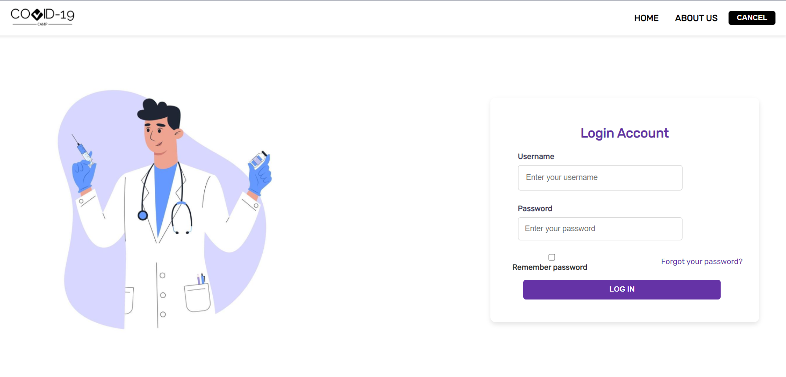
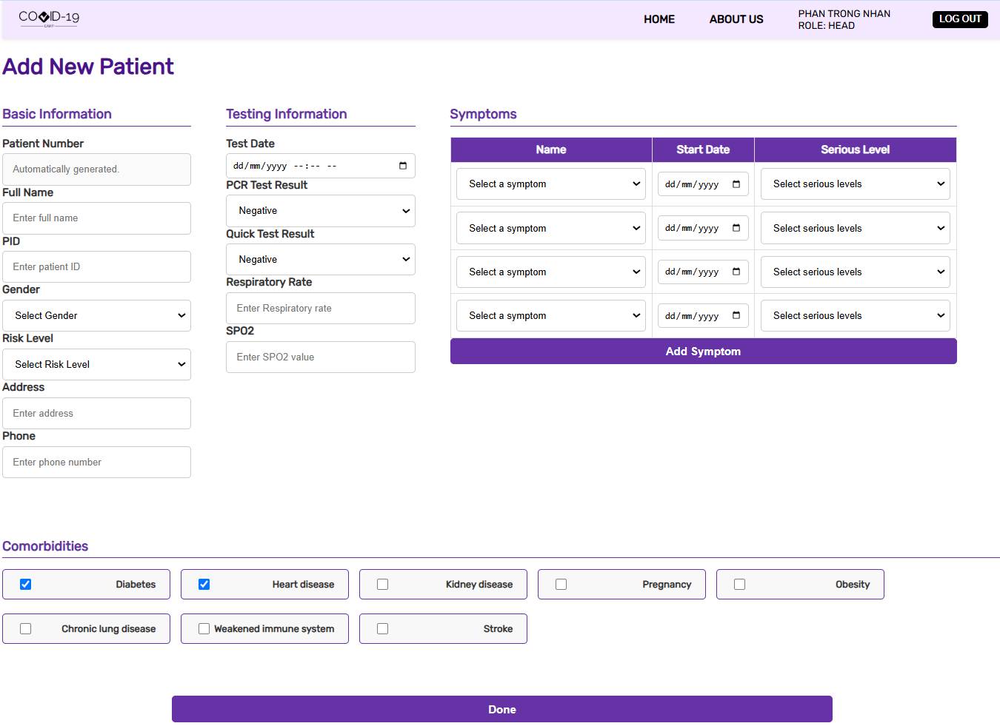
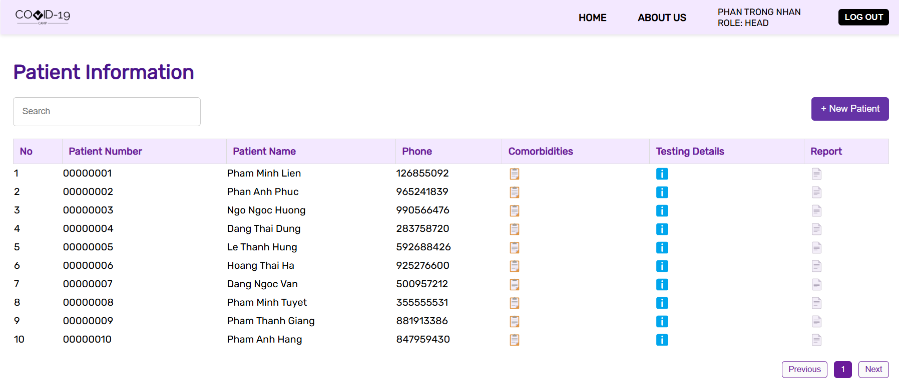

# **Quarantine Camp Management System**
---
## Overview
The Quarantine Camp Management System is designed specifically for dealing with COVID-19 pandemic. This system help enhance the efficency and ensure the reliablity of data in management tasks relevant to: patients, staffs, facilities and medicines.

<h3>Login Page</h3>

<h3>Add Patient Page</h3>

<h3>Search Patient Page</h3>

---

## Application
### Frontend
- Language: Javascript
- Framework: React
### Backend
- Language: Python
- Framwork: FastAPI
### Database
- DBMS: mySQL
- The database is tailored for COVID-19, so it will contain symptoms which relevant to this disease. 
